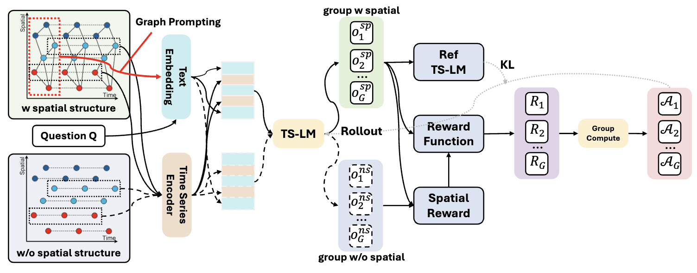

<div align="center">

# STReasoner: Time Series LLM for Spatio-Temporal Reasoning

**Empowering LLMs for Spatio-Temporal Reasoning in Time Series via Spatial-Aware Reinforcement Learning**

[](https://www.python.org/)
[](https://developer.nvidia.com/cuda-toolkit)
[](LICENSE)
[](https://huggingface.co/datasets/Time-HD-Anonymous/ST-Bench)
[](https://huggingface.co/Time-HD-Anonymous/STReasoner-8B)


</div>

---

## ✨ Highlights

- 📊 **Multimodal Benchmark** — ST-Bench for spatio-temporal reasoning in time series

- 🔗 **Time Series Encoder Integration** — LLM with dedicated time series encoder  
  *Supports: Qwen3-8B, Qwen3-4B-Instruct, Qwen2.5-14B-Instruct*

- 🚀 **Full Training Pipeline** — First SFT + RL training pipeline for LLM with time series encoder

---

## 📰 News

- **[2025/01/06]** 🎉 Released full pipeline training code for STReasoner

---

## 📖 Overview




**STReasoner** is a framework designed for spatio-temporal reasoning in time series data, trained through a carefully designed **three-stage pipeline**:

| Stage | Method | Description |
|:-----:|:------:|:------------|
| 1 | SFT | Supervised fine-tuning for time series alignment |
| 2 | SFT | Supervised fine-tuning for cold-start reasoning |
| 3 | RL | Reinforcement learning with **S-GRPO** (Spatial-aware Group Relative Policy Optimization) |

---

## ⚙️ Requirements

**Hardware:** 8 × NVIDIA A100-SXM4-80GB (or equivalent)

**Software:** CUDA 12.8

### SFT Environment (Stage 1 & 2)

```bash
conda create --name str python==3.10
conda activate str
pip install -r requirements.txt
```

### RL Environment (Stage 3)

```bash
docker pull hiyouga/verl:ngc-th2.8.0-cu12.9-vllm0.11.0
```

---

## 📦 Data Preparation

Download the **ST-Bench** dataset from [🤗 HuggingFace](https://huggingface.co/datasets/Time-HD-Anonymous/ST-Bench):

```bash
python download_dataset.py
```

---

## 🚀 Training

### 1. Prepare Base Model

```bash
python download_model.py --repo_id Qwen/Qwen3-8B
cp -rf base_model/Config-Qwen3-8B/* base_model/Qwen3-8B/
python initial_model.py
```

### 2. Stage 1 & 2 (SFT)

```bash
bash scripts/qwen3-8b/train_stage1.sh      # → STReasoner-8B-Align
bash scripts/qwen3-8b/train_stage1+2.sh    # → STReasoner-8B-CoT
```

> 📦 **SFT Checkpoints:**  
> [STReasoner-8B-Align](https://huggingface.co/Time-HD-Anonymous/STReasoner-8B-Align) · [STReasoner-8B-CoT](https://huggingface.co/Time-HD-Anonymous/STReasoner-8B-CoT)

### 3. Stage 3 (RL)

Launch the Docker container:

```bash
docker run -it --gpus all \
  --name verl_env \
  --shm-size=40g \
  -v .:/workspace/SpatialTemporalReasoning \
  hiyouga/verl:ngc-th2.8.0-cu12.9-vllm0.11.0 bash
```

Inside the container:

```bash
cd STReasoner

# With Spatial-aware GRPO
bash scripts/qwen3-8b/train_stage1+2+3_w_spatial.sh

# Or with vanilla GRPO
bash scripts/qwen3-8b/train_stage1+2+3.sh
```

### 4. Merge Checkpoint

```bash
cp base_model/Config-Qwen3-8B/modeling_qwen3_ts.py \
   checkpoints/easy_r1/qwen3_8b_grpo_stage1+2+3_w_spatial/global_step_51/actor/huggingface

python model_merger.py \
   --local_dir checkpoints/easy_r1/qwen3_8b_grpo_stage1+2+3_w_spatial/global_step_51/actor/
```

---

## 🔮 Inference

Run inference across all reasoning tasks:

```bash
for task in reasoning_forecasting reasoning_entity reasoning_etiological reasoning_correlation; do 
    python inference/inference_tsmllm_vllm.py \
        --task $task \
        --model_path checkpoints/easy_r1/qwen3_8b_grpo_stage1+2+3_w_spatial/global_step_51/actor/huggingface
done
```

---

## 📊 Evaluation

Evaluate model performance on each task:

```bash
for task in reasoning_forecasting reasoning_entity reasoning_etiological reasoning_correlation; do 
    python evaluation/evaluate.py \
        --task $task \
        --exp_path exp/$task-qwen3_8b_grpo_stage1+2+3_w_spatial
done
```

---

## 🎨 Alternative Training: Text or Image Prompting

| Modality | Stage 2 Script | Stage 2+3 Script |
|:--------:|:--------------|:-----------------|
| **Text** | `scripts/qwen3-8b/train_stage2_only_text.sh` | `scripts/qwen3-8b/train_stage2+3_w_spatial_only_text.sh` |
| **Image** | `scripts/qwen3-vl-8b-instruct/train_stage2_only_image.sh` | `scripts/qwen3-vl-8b-instruct/train_stage2+3_w_spatial_only_image.sh` |

---

## 🙏 Acknowledgements

We thank the following projects for their valuable contributions:

- [EasyR1](https://github.com/hiyouga/EasyR1) — Reinforcement learning framework for our RL training setup
- [Verl](https://github.com/volcengine/verl) — Reinforcement learning framework and environment for Stage 3 training
- [ChatTS](https://github.com/NetManAIOps/ChatTS) — Temporal-spatial encoder and HuggingFace/vLLM implementations
- [LLaMA-Factory](https://github.com/hiyouga/LLaMA-Factory) — Supervised fine-tuning framework for SFT stages
- [vLLM](https://github.com/vllm-project/vllm) — Fast model inference engine

---

<div align="center">

**If you find this work useful, please consider giving it a ⭐!**

</div>
